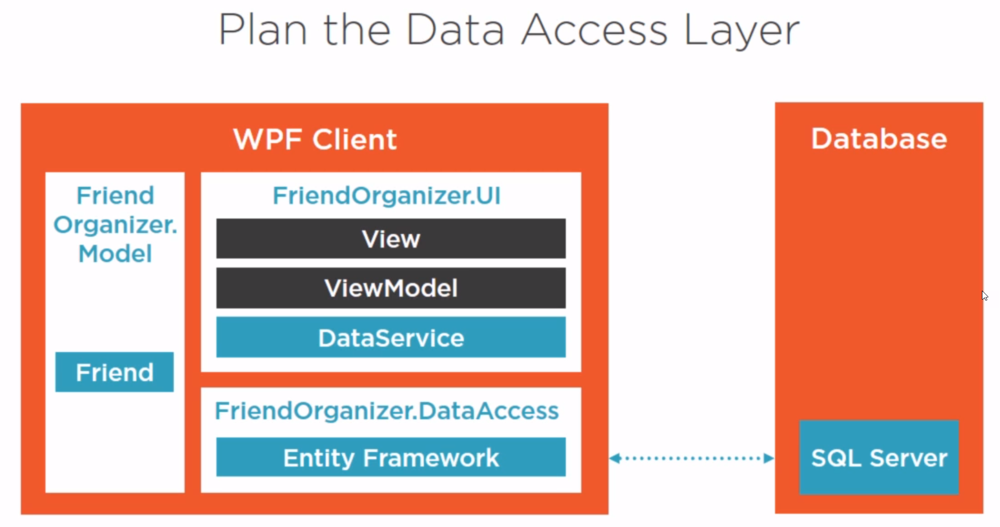

## EF Core



Installér følgende NuGet pakker til projektet DataAccess:

- Microsoft.EntityFrameworkCore.SqlServer
- Microsoft.EntityFrameworkCore.Tools

Og installer følgende til UI-projektet:

- Microsoft.EntityFrameworkCore.SqlServer
- Microsoft.EntityFrameworkCore.Design

Tilføj connectionstring til App.config i UI-projektet (efter ```<configuration>.<startup>```):

```xml
<connectionStrings>
  <add name="FriendOrganizerDb" connectionString="Server = (localdb)\mssqllocaldb; Database = FriendOrganizerDb; Trusted_Connection = True;" />
</connectionStrings>
```

Husk at lave en reference i UI-projektet til ```System.Configuration```.

Opret klassen FriendOrganizerDbContext DataAccess projektet:

```c#
public class FriendOrganizerDbContext : DbContext
{
    public FriendOrganizerDbContext(DbContextOptions<FriendOrganizerDbContext> options) : base(options)
    {}

    public DbSet<Friend> Friends { get; set; }

    protected override void OnConfiguring(DbContextOptionsBuilder optionsBuilder)
    {
    }

    protected override void OnModelCreating(ModelBuilder modelBuilder)
    {
        modelBuilder.Entity<Friend>().HasData(
            new Friend { Id = 1, FirstName = "Thomas", LastName = "Huber" },
            new Friend { Id = 2, FirstName = "Urs", LastName = "Meier" },
            new Friend { Id = 3, FirstName = "Erkan", LastName = "Egin" },
            new Friend { Id = 4, FirstName = "Sara", LastName = "Huber" }
            );
    }
}
```

I Bootstrapper klassen skal EF Core registreres med en tilhørende DbContextOptions parameter.

Imidlertid er Autofac servicen ikke startet op på det design tidspunkt hvor vi
evt. ønsker at lave en Migration. Derfor skal Bootstrapper klassen implementere
```IDesignTimeDbContextFactory<T>``` og metoden ```CreateDbContext()```som opretter en instans
af DbContext:

```c#
public class Boostrapper : IDesignTimeDbContextFactory<FriendOrganizerDbContext>
{
    DbContextOptions<FriendOrganizerDbContext> dbContextOptions = new DbContextOptionsBuilder<FriendOrganizerDbContext>()
        .UseSqlServer(ConfigurationManager.ConnectionStrings["FriendOrganizerDb"]
        .ConnectionString)
        .Options;

    public IContainer Bootstrap()
    {
        var builder = new ContainerBuilder();

        builder.RegisterType<FriendOrganizerDbContext>().WithParameter("options", dbContextOptions).InstancePerLifetimeScope();
        builder.RegisterType<MainWindow>().AsSelf();
        builder.RegisterType<MainViewModel>().AsSelf();
        builder.RegisterType<FriendDataService>().As<IFriendDataService>();

        return builder.Build();
    }

    public FriendOrganizerDbContext CreateDbContext(string[] args)
    {
        return new FriendOrganizerDbContext(dbContextOptions);
    }
}
```


